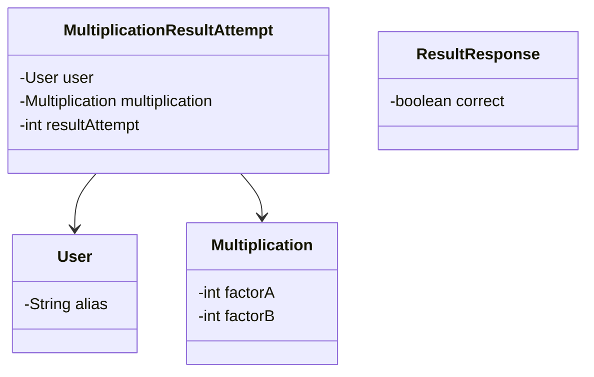
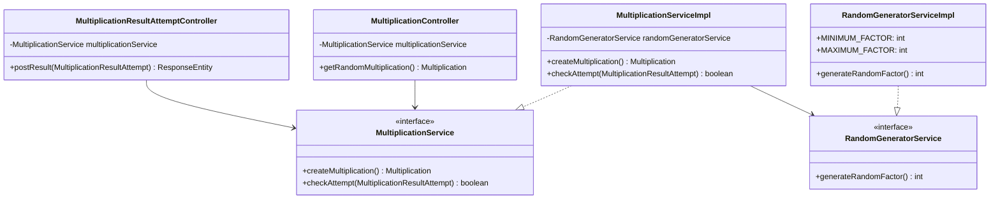
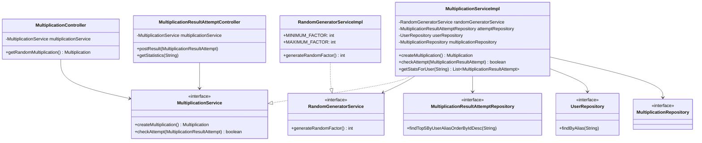

# 단계별 정리
### 1차 요구사항 (기본 MVC 개발)
- [x] 온라인으로 무작위로 생성되는 곱셈 문제 사이트를 개발
- [x] 문제는 11~99 사이의 두 개의 정수의 곱으로 구성

#### 도메인 다이어그램

#### 클래스 다이어그램

### 2차 요구사항 (데이터베이스 연동)
- [x] 답안 제출 기록 저장
- [x] 최근 5개의 답안 제출 기록 확인 기능 추가
#### 클래스 다이어그램
